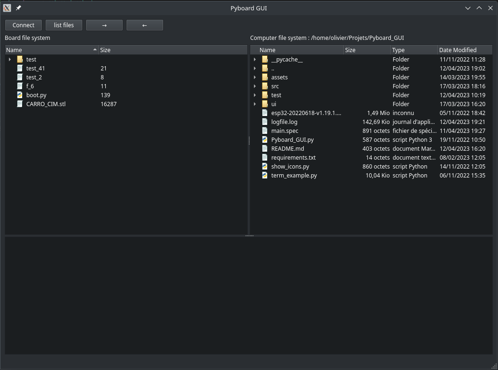

# Pyboard GUI

This projet is a GUI in QT made to easily transfer files and directories from computer to ESP32 board with micropython installed, it should work with other microcontrolers

## Requirements

- Python 3.11+
- pyserial
- pyqt6

## On linux

Clone the repository, cd inside, and launch with the command
`python3 Pyboard_GUI.py`

### Access to the board

In order to have access to the board the user may need to be in dialout group, for that type the command :
`sudo usermod -a -G dialout $USER`

## On Windows

You can do the same as in Linux.  
Or you can install pyinstaller and build the projet with the command
`pyinstaller.exe --clean .\main.spec`

You should find in the directory .\dist the executable _main.exe_

## Version

0.1